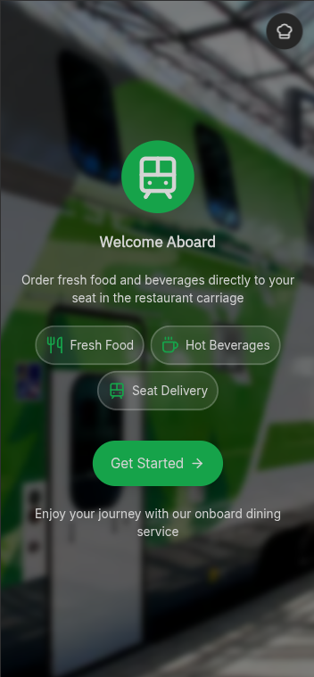
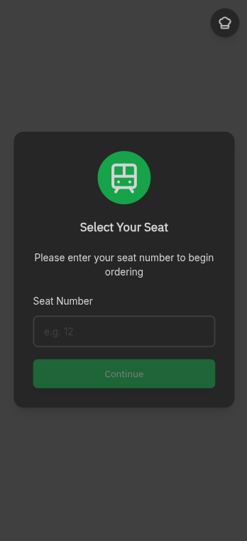
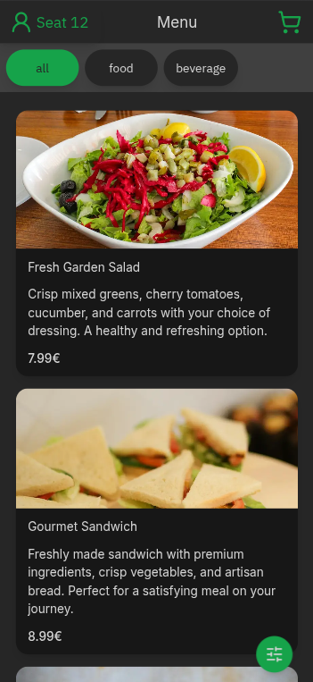
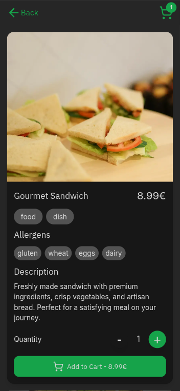
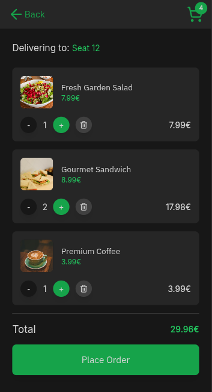
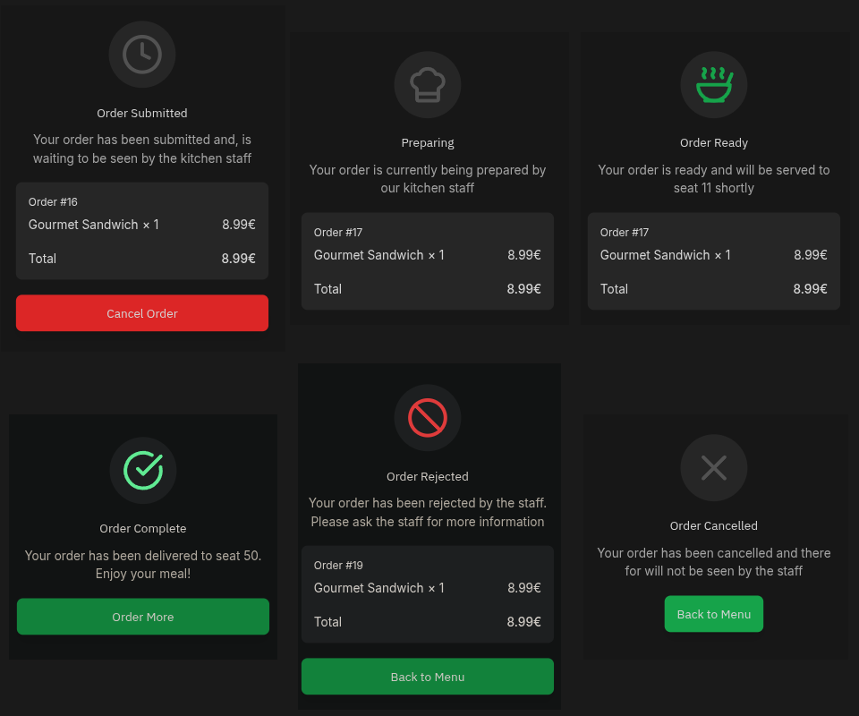
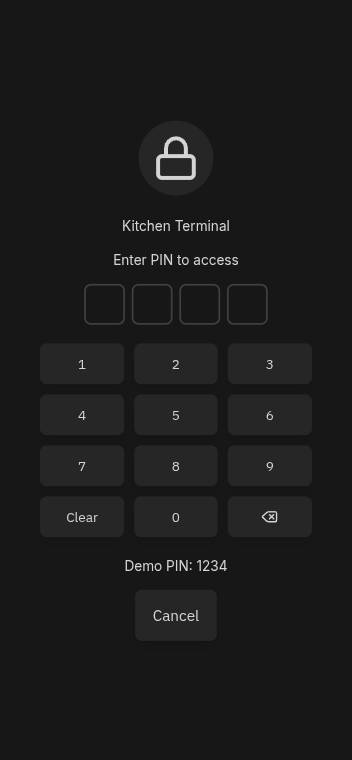
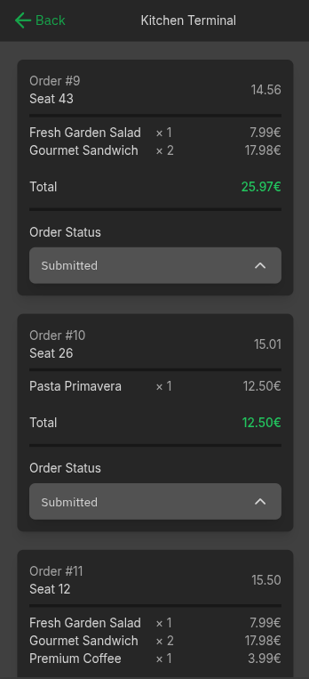

# Train Restaurant Food Ordering System - User Manual

This web application ordering system enables passengers aboard train restaurant carriages to browse menus, place orders, and receive real-time status updates without flagging down staff. In real-world deployment, this reduces service bottlenecks, minimizes order errors through direct digital communication, and allows kitchen staff to manage workload efficiently during transit when physical movement through carriages is challenging.

## Customer Journey

### Getting Started

Upon opening the app, you're greeted with the welcome screen featuring three core service promises: fresh food, beverages, and direct seat delivery. Tap **Get Started** to begin ordering.

### Seat Selection

Enter your seat number (1-99) to establish your session. This associates all orders with your physical location for accurate delivery. The system validates your input and prevents zero or invalid entries. Production version would see the train your are aboard and maps the seat numbers accordingly.

### Browsing the Menu

The menu interface displays your seat number in the top-left corner and a cart icon in the top-right. Filter items using the category buttons that span horizontally below the header:
- **Primary filters**: View all items or narrow by category type (food, beverages, etc.)
- **Secondary filters**: When a category is selected, subcategories appear for refined browsing
- **Advanced filters**: Tap the floating filter button to set price ranges or exclude specific allergens

[Filters](./docs/production/screenshots/filter_panel.png)

Scroll vertically through menu items. Each card shows the item name, price, description, and image.

### Item Details

Tap any menu item to view its detailed page. This screen displays the full description, price, allergen information, and a prominent **Add to Cart** button. Adjust quantity using the +/- controls before adding.

### Managing Your Cart

The cart screen lists all selected items with individual quantities and prices. You can:
- Adjust quantities using +/- buttons on each item
- Remove items by reducing quantity to zero
- Review the total price at the bottom
- Tap **Place Order** to submit your order to the kitchen

Once submitted, you cannot edit the order — cancellation is only available during the initial "Submitted" status.

### Order Status Tracking

After placing an order, you'll automatically see real-time status updates. Your order progresses through these stages:

1. **Submitted** - Order awaiting kitchen acknowledgment (cancellable via button)
2. **Confirmed** - Kitchen has seen your order and will begin preparation
3. **Preparing** - Kitchen staff are actively making your items
4. **Ready** - Order is complete and staff will deliver shortly
5. **Delivered** - Order successfully served to your seat

Two terminal states may occur:
- [ ] **Rejected** - Kitchen cannot fulfill the order (consult staff for reasons)
- **Cancelled** - You cancelled before kitchen confirmation

From terminal states, tap **Order More** or **Back to Menu** to continue browsing.

## Kitchen Staff Interface

### Kitchen Login

Staff access the kitchen terminal by entering a 4-digit PIN. This creates a kitchen session separate from customer sessions and provides access to the order management interface.

### Kitchen Terminal

The kitchen dashboard displays all active orders in real-time (auto-refreshes every 5 seconds). Each order card shows:
- Seat number for delivery location
- Order creation timestamp
- Complete list of items with quantities
- Total order price
- Current status badge

Staff can update order status by tapping status buttons on each card, progressing orders through the workflow. Orders with terminal statuses (DELIVERED, REJECTED, CANCELLED) are automatically hidden from the view to reduce clutter.

---

### Techincal Stack

Technology: Next.js 14, React 18, TypeScript, Prisma ORM, PostgreSQL, tRPC, TanStack Query, Tailwind CSS

Hosting: Vercel (infra), Neon Serverless Postgres (database)
